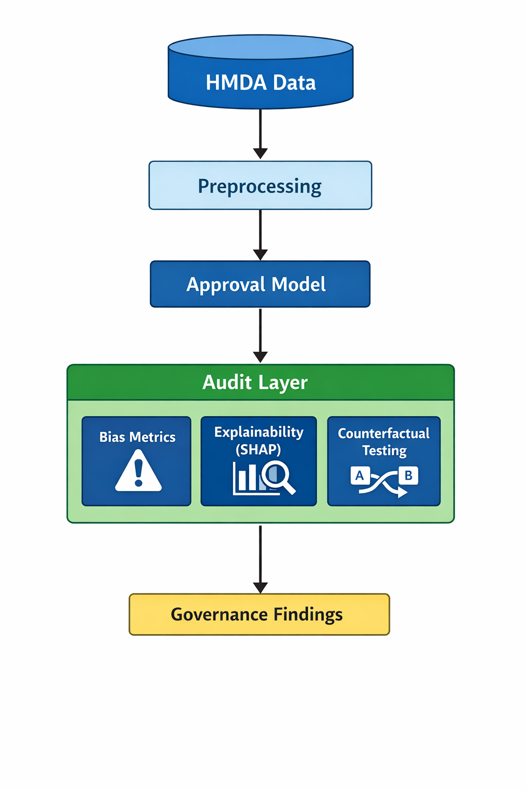

# Algorithmic Auditor — HMDA Loan Approval Case Study

This project implements a **full-stack algorithmic audit** of a loan approval system using U.S. Home Mortgage Disclosure Act (HMDA) data.

The system is designed to evaluate **bias, uncertainty, and decision logic** in automated decision-making systems, with a focus on legal accountability and governance.

---

## Motivation

Automated lending systems are increasingly deployed in high-stakes domains governed by civil rights law.  
This project answers:

> *Can a model be formally “race-neutral” while still reproducing structural inequities?*

---
This audit operationalizes that question using formal fairness metrics, counterfactual analysis, and governance review.


## Pipeline Overview


*Figure 1: End-to-end algorithmic audit pipeline for HMDA loan approval decisions.*


1. **Data Ingestion & Preprocessing**
   - Deterministic filtering and normalization of HMDA records
   - Controlled downsampling for reproducibility
   - Explicit handling of sensitive attributes

2. **Baseline Predictive Model**
   - Binary loan approval classifier
   - AUC ≈ 0.79 on held-out data
   - Model frozen and versioned via Git tag (`baseline-hmda-2024`)


3. **Fairness Diagnostics**
   - Base rate analysis by protected class
   - Demographic parity
   - Equal opportunity

4. **Explainability**
   - Global feature attribution (SHAP)
   - Group-wise explanation comparisons
   - Identification of proxy variables

5. **Counterfactual Testing**
   - Race-swapped counterfactual evaluation
   - Measurement of approval delta under attribute substitution

6. **Governance Analysis**
   - Deployment risks
   - Legal compliance considerations
   - Documentation for auditability

---

## Key Findings

- The model satisfies counterfactual fairness tests with respect to race under controlled attribute substitution.
- Despite this, approval rates vary significantly across racial groups.
- Disparities emerge through **correlated financial variables**, not explicit protected attributes.
- This demonstrates how “neutral” models can reproduce structural inequality.

---

## Reproducibility

The following scripts reproduce the full audit pipeline from raw data preprocessing to fairness evaluation:

```bash
python src/data/preprocess.py
python src/diagnostics/base_rates.py
python src/model/train_model.py
python src/audit/fairness.py
python src/audit/explainability.py
python src/audit/counterfactual.py
```

## Baseline Version

The frozen experimental baseline is tagged as: 

baseline-hmda-2024

## Disclaimer

This project is for research and educational purposes only.
It does not constitute legal advice or a production-ready lending system.